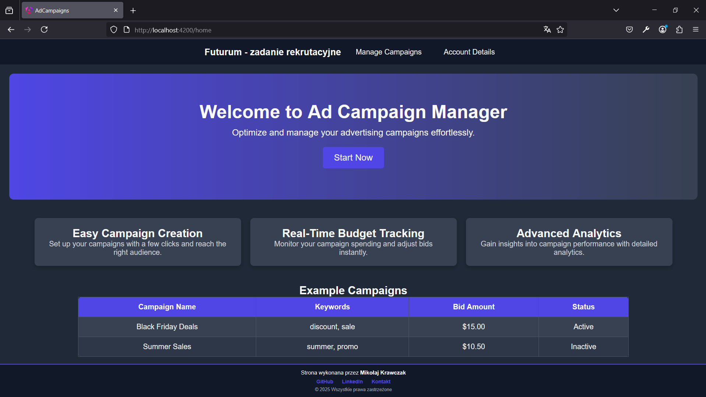

<h1>🚀 Ad Campaigns - Angular & Spring Boot</h1>

<h2>📖 Opis</h2>

<b>Ad Campaigns</b> to pełnoprawna aplikacja webowa do zarządzania kampaniami reklamowymi. 
Jest podzielona na <b>frontend</b> (Angular) oraz <b>backend</b> (Spring Boot).

Funkcjonalności obejmują:

<ul>
  <li>✅ Tworzenie i edycję kampanii reklamowych</li>
  <li>✅ Obsługę balansu użytkownika</li>
  <li>✅ Pobieranie dostępnych miast i słów kluczowych</li>
  <li>✅ Obsługę zapytań API do backendu</li>
</ul>

<h2>🛠️ Technologie</h2>
<h3>🎨 Frontend (Angular 19 Standalone Components)</h3>
<ul>
  <li><b>Angular 19</b></li>
  <li><b>TypeScript</b></li>
  <li><b>SCSS</b></li>
</ul>

<h3>⚙ Backend (Spring Boot)</h3>
<ul>
  <li><b>Spring Boot 3.4.2</b></li>
  <li><b>Java OpenJDK21</b></li>
  <li><b>PostgreSQL</b> </li>
  <li><b>Maven</b> (Automoatyzator kompilacji)</li>
</ul>

<h3> 🐋 Docker (Pełna konteneryzacja)</h3>

Projekt został <b>całkowicie zdockeryzowany</b>, co oznacza, że wszystkie zależności są zarządzane i pobierane automatycznie. Możesz uruchomić aplikację jedną komendą, bez potrzeby instalowania osobno Angulara, Javy czy PostgreSQL.
  

<h2>🚀 Instalacja i uruchomienie</h2>

Projekt został w pełni <b>zdockeryzowany</b>, co oznacza, że wszystkie zależności (Maven, Angular, Java, Spring Boot, baza danych PostgreSQL itd.) są automatycznie pobierane i konfigurowane. Jeśli masz zainstalowany i działający silnik Docker, możesz uruchomić cały projekt jedną komendą!

<h3>✅ 1. Klonowanie repozytorium</h3>
<pre><code>git clone https://github.com/MKravczak/ad-campaigns-crud_MK.git
cd ad-campaigns-crud_MK
</code></pre>

<h2>🐳 Uruchomienie aplikacji za pomocą Docker Compose</h2>

<h3>🔹 2. Wymagania</h3>
<ul>
  <li>✔ <b>Docker</b> (zainstalowany i uruchomiony)</li>
  <li>✔ <b>Docker Compose</b></li>
</ul>

<h3>🔹 3. Uruchomienie całego projektu jednym poleceniem</h3>
<pre><code>docker-compose up --build</code></pre>

<h3>🔹 4. Co się teraz dzieje?</h3>

Po wykonaniu tej komendy Docker Compose wykona następujące operacje:

<ol>
  <li>📦 Pobierze wszystkie niezbędne obrazy Dockera (Maven, Node.js, OpenJDK 21, PostgreSQL itp.).</li>
  <li>⚙️ Zbuduje backend Spring Boot korzystając z pliku <b>Dockerfile</b> znajdującego się w folderze <code>backend</code>.</li>
  <li>⚙️ Zbuduje frontend Angulara na podstawie <b>Dockerfile</b> w katalogu <code>frontend</code>.</li>
  <li>🗄️ Uruchomi bazę danych PostgreSQL z prekonfigurowanymi tabelami.</li>
  <li>🔗 Połączy wszystkie kontenery w jedną sieć <b>app_network</b>, umożliwiającą komunikację między frontendem i backendem.</li>
  <li>🚀 Na końcu uruchomi całą aplikację.</li>
</ol>

<h3>🔹 5. Gdzie znaleźć działającą aplikację?</h3>
<ul>
  <li>🎯 Frontend Angular: <b><a href="http://localhost:4200">http://localhost:4200</a></b></li>
  <li>🛠 Backend API (Spring Boot): <b><a href="http://localhost:8080">http://localhost:8080/api</a></b></li>
  <li>📊 Panel PostgreSQL: <b><a href="http://localhost:5432">http://localhost:5432</a></b></li>
</ul>

---

<h2>⚠️ Co jeśli Docker Compose nie działa?</h2>

Jeśli z jakiegoś powodu uruchomienie Dockera nie działa poprawnie (np. system operacyjny nie obsługuje w pełni kontenerów), możesz uruchomić backend i frontend ręcznie.

<h2>🔧 Ręczna instalacja i uruchomienie</h2>

<h3>✅ 1. Instalacja i uruchomienie backendu (Spring Boot + Maven)</h3>

<h4>Wymagania:</h4>
<ul>
  <li>✔ <b>Java 21+</b> (OpenJDK 21)</li>
  <li>✔ <b>Maven</b></li>
  <li>✔ <b>PostgreSQL</b> (lokalnie lub jako kontener w Dockerze)</li>
</ul>

<h4>Kroki:</h4>
<pre><code>cd backend
mvn spring-boot:run
</code></pre>

Jeśli wszystko poszło dobrze, backend powinien działać pod adresem:

👉 <b><a href="http://localhost:8080">http://localhost:8080</a></b>

---

<h3>✅ 2. Instalacja i uruchomienie frontendu (Angular 19)</h3>

<h4>Wymagania:</h4>
<ul>
  <li>✔ <b>Node.js 20+</b></li>
  <li>✔ <b>NPM</b></li>
</ul>

<h4>Kroki:</h4>
<pre><code>cd frontend
npm install
npm run dev
</code></pre>

Frontend powinien działać na:

👉 <b><a href="http://localhost:4200">http://localhost:4200</a></b>
<h3>Powinna nam się na nim ukazać taka strona startowa</h3>

---

<h2>🐧 Instalacja na Ubuntu</h2>

Jeśli pracujesz na <b>Ubuntu</b>, oto jak możesz skonfigurować system, aby wszystko działało poprawnie:

<h3>🔹 1️⃣ Instalacja Dockera i Docker Compose</h3>

<pre><code>sudo apt update
sudo apt install docker.io -y
sudo systemctl start docker
sudo systemctl enable docker
</code></pre>

Sprawdzenie, czy Docker działa:

<pre><code>docker --version</code></pre>

Jeśli nie masz Docker Compose, zainstaluj go:

<pre><code>sudo apt install docker-compose -y</code></pre>

<h3>🔹 2️⃣ Instalacja Javy i Maven</h3>

<pre><code>sudo apt install openjdk-21-jdk -y
java -version
</code></pre>

Instalacja Maven:

<pre><code>sudo apt install maven -y
mvn -version
</code></pre>

<h3>🔹 3️⃣ Instalacja Node.js i NPM</h3>

<pre><code>sudo apt install nodejs -y
sudo apt install npm -y
node -v
npm -v
</code></pre>

---

<h2>📜 Podsumowanie</h2>

<ul>
  <li>✅ Najłatwiejszy sposób na uruchomienie aplikacji: <code>docker-compose up --build</code></li>
  <li>✅ Jeśli Docker nie działa, uruchom backend i frontend ręcznie.</li>
  <li>✅ Na Ubuntu warto zainstalować Docker, OpenJDK, Maven i Node.js przed startem.</li>
</ul>

<h2>📩 Kontakt</h2>

Masz pytania lub sugestie? Skontaktuj się!

📧 <b>E-mail:</b> krawczak.mikolaj@gmail.com

🔗 <b>GitHub:</b> <a href="https://github.com/MKravczak">Github</a>

